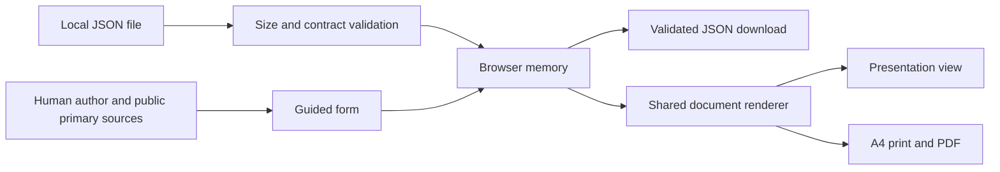

# Council OnePager project memory

This document describes tracked implementation, not an audit of a running public
service. Read it before changing the project.

## Purpose and current scope

Create a clear public working brief for one specific council deliberation or
decision. A continuing political topic may have multiple briefs for different
meetings. The tool is independent of RötgesPortal and municipal authorities.

The initial implementation supports a German form, in-memory editing, versioned
JSON files, a presentation view, and an A4 browser print/PDF view. All documents
are working drafts; there is no implemented approval workflow. Missing fields
are shown as open, not supplied through inference.

## Architecture

React and TypeScript render a static Vite application. There is no application
backend, database, login, source scanner, service worker, AI integration, or
automatic publication. Hosting requests still reach the static host; editorial
input is not submitted to it by this application.



No municipality branding or official endorsement is implied. The architecture
decision is [ADR 0001](architecture/adr-0001-browser-first.md).

## Responsibilities and data flow

- `src/domain/brief.ts`: Zod structural contract, inferred types, initial blank
  document, cross-reference validation, readiness hints, and display formatting.
- `src/domain/files.ts`: UTF-8 size limit (256 KiB), JSON parsing, validated
  serialization, and user-triggered Blob downloads.
- `src/components/BriefEditor.tsx`: explicitly labeled, controlled German form.
- `src/components/BriefDocument.tsx`: one renderer with paper/presentation modes.
- `src/App.tsx`: local state, import/export, replacement confirmation, unload
  warning, view selection, and page-overflow detection.
- `tools/export-schema.ts`: deterministic JSON Schema generation from Zod.
- `schemas/brief.schema.json`: checked-in generated structural contract. It does
  not express all application-level checks and does not certify factual content.

JSON is the portable document format. It is a separate document contract from
RötgesPortal topic YAML; this repository does not change the portal's source of
truth. Imported files must have schema version `1.0`, public visibility, and
draft editorial state. Unsupported versions are rejected; no migration is yet
implemented. Unknown properties are rejected rather than silently discarded.

Empty fields are valid for incomplete drafts. Money with a known status needs a
non-negative decimal string in euros, with at most two decimal places and no
thousands separator. Unknown amounts carry an empty string. Grant status and
budget coverage are independent fields. There is no automatic subtraction of
grants from costs. See the [data contract](architecture/data-contract.md).

## Persistence and privacy

The application holds input in React memory, with no localStorage, IndexedDB,
cookies, background saves, upload endpoint, or analytics. Downloading JSON is the
explicit save operation. Refresh/close warnings are best-effort browser behavior.
Download initiation cannot verify a successful disk save.

Replacing unsaved data asks for confirmation. Malformed, oversized, unsupported,
or unsafe imports fail without replacing existing state. File extensions and
MIME types are convenience hints only; content validation is authoritative.

Imported text is rendered through React escaping, never as raw HTML. Source URLs
must use HTTP(S) without URL credentials. The application does not fetch source
documents. Links are opened only by the user with `noopener noreferrer`.
Protocol validation does not prove that a source is public or trustworthy.

## Editorial model

The decision question and proposed wording remain separate from consultation
outcomes. A proposed implementation step is explicitly conditional on adoption.
Authors assign sources to content sections and can link specific consultations
to source IDs. Source records include title, URL, precise locator, and actual
access date; dates are never auto-filled as verified.

Readiness hints check presence only. Every output remains labeled
`ARBEITSENTWURF` and explicitly states that factual review and approval are pending.
The [editorial policy](governance/editorial-policy.md) governs human review.

## Layout and export

Both views use the same underlying data. The presentation view omits technical
budget allocation details and full source URLs/locators. Financial qualifiers,
cost notes, affected-group information, and entered reporting details remain
visible in both views. The A4 view includes the full references and allocation.

A hidden, measurable A4 rendering uses the same print styles and physical width.
Its natural height is compared with A4's aspect ratio. If it exceeds the page,
the application's print button is disabled; JSON saving remains available.
Presentation height is checked against 16:9 and warns without clipping content.
Neither mode silently truncates text or reduces font size to fit.

PDF uses the browser print dialog, not a server or dedicated PDF engine. Use A4,
100% scale, no browser headers/footers. Browser print settings and font rendering
can affect output. Direct browser printing can bypass the application's button
guard and may produce multiple pages; content is not forcibly clipped. The
browser test exercises Chromium; other browsers require additional visual QA.

## Toolchain and dependencies

The baseline is Node.js 22.23.2 and pnpm 11.20.0. Dependencies are recorded in
`package.json` and `pnpm-lock.yaml`. TypeScript 5.9 is chosen for compatibility
with the installed TypeScript ESLint parser's supported range.

Vite produces a static `dist/` bundle. There is no Next.js runtime or server
framework. Vitest runs domain/rendering tests; Playwright checks the production
bundle in desktop and mobile Chromium. ESLint and Prettier check source quality.

## Validation commands

```sh
pnpm install --frozen-lockfile
pnpm schema:generate  # only when changing the authoritative contract
pnpm check
pnpm exec playwright install chromium
pnpm test:e2e
git diff --check
```

`pnpm check` runs schema freshness, TypeScript and production build, unit tests,
lint, then formatting. Build before browser tests. On Linux CI, install browser
OS dependencies with `pnpm exec playwright install --with-deps chromium`.

CI runs for pushes and pull requests with read-only repository permissions.
It does not deploy or publish documents. GitHub Actions are pinned to concrete
commits. Dependency updates are proposed through Dependabot.

## Operations and remaining decisions

See [static-hosting guidance](../deploy/README.md) and the
[development runbook](operations/development.md). No deployment is configured.
The example proxy configuration is guidance, not an executed production setup.

The following are **Unknown / not documented in repository**:

- Chosen software license and distribution terms.
- Production host, domain, operator, legal/privacy information, logging policy.
- Municipal sponsorship, owner of official review, and accepted pilot workflow.
- Accessibility audit, browser compatibility beyond the checked test projects,
  operational backups, and a successful deployment/restore rehearsal.

Future work is recorded in [ROADMAP.md](ROADMAP.md), not presented as implemented.
